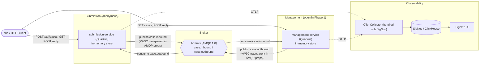

## 2. System Overview

Two services. One broker. One observability backend. Nothing else in the hot path.

```mermaid
flowchart LR
    subgraph SubZone["Submission (anonymous)"]
        SS["submission-service (Quarkus)<br/>in-memory store"]
    end

    subgraph MgmtZone["Management (open in Phase 1)"]
        MS["management-service (Quarkus)<br/>in-memory store"]
    end

    subgraph Broker["Broker"]
        MQ{{"Artemis (AMQP 1.0)<br/>case.inbound / case.outbound"}}
    end

    subgraph Obs["Observability"]
        OC["OTel Collector (bundled with SigNoz)"]
        BE[("SigNoz / ClickHouse")]
        UI["SigNoz UI"]
    end

    client(["curl / HTTP client"]) -->|"POST /api/cases, GET, POST reply"| SS
    client -->|"GET cases, POST reply"| MS

    SS -->|"publish case.inbound<br/>(+W3C traceparent in AMQP props)"| MQ
    MQ -->|"consume case.inbound"| MS
    MS -->|"publish case.outbound<br/>(+W3C traceparent in AMQP props)"| MQ
    MQ -->|"consume case.outbound"| SS

    SS -.->|"OTLP"| OC
    MS -.->|"OTLP"| OC
    OC --> BE --> UI
```