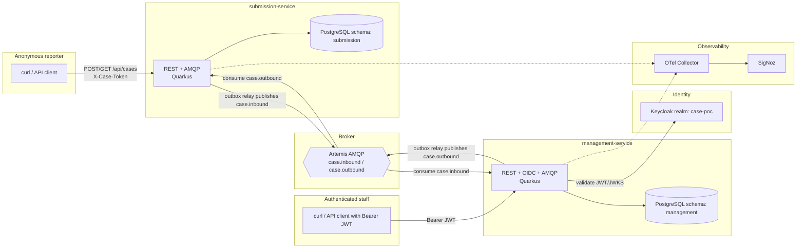

# Phase 2 - Persistent and Authenticated Application Architecture

> **Scope of this document.** This is the second application-development stage. It assumes Phase 1 already exists: two Quarkus services, ActiveMQ Artemis over AMQP, SigNoz/OpenTelemetry, a two-way text-only case thread, and no direct service-to-service calls. Phase 2 should not rebuild or re-explain Phase 1. It adds durable state, authenticated management access, and reliable publish/consume semantics while preserving the cross-Artemis trace.

---

## 1. Goal and Non-Goals for Phase 2

**The one thing to prove:** the Phase 1 traced message flow still works after replacing in-memory state with PostgreSQL and protecting the management API with Keycloak.

The reviewer should be able to:

1. Submit an anonymous case.
2. Restart both application services without losing the case or message thread.
3. Log in as an authenticated staff user and view/reply to the case.
4. See the staff identity recorded on the reply.
5. Temporarily stop Artemis, submit/reply, restart Artemis, and see pending outbox events publish.
6. Open SigNoz and confirm the trace includes HTTP, database work, outbox publish, AMQP publish/consume, and consumer database writes.

**In scope (Phase 2)**
- PostgreSQL persistence for both services.
- Separate database ownership per service: separate schemas and database users, even if one PostgreSQL instance is used locally.
- Flyway-managed schema migrations.
- Persistent inbox tables for idempotent consumers.
- Transactional outbox tables for reliable event publishing.
- Keycloak-backed authentication and authorization for the management API.
- Authenticated staff identity on management replies.
- Continued OpenTelemetry instrumentation for REST, AMQP, and database work.
- Local `docker-compose` support for PostgreSQL and Keycloak in addition to Artemis and SigNoz.

**Out of scope for Phase 2**
- Attachments, ClamAV scanning, and MinIO/S3 object storage.
- Angular frontends and browser RUM.
- Kubernetes, Helm, ingress, TLS, HPA/VPA, and queue-depth autoscaling.
- Multi-tenancy, service mesh/mTLS, CI/CD, and production-grade rate limiting.

---

## 2. Phase 1 Baseline to Keep

Do not change these architectural rules from Phase 1:

- `submission-service` and `management-service` never call each other directly.
- Reporter-to-staff messages use `case.inbound`.
- Staff-to-reporter messages use `case.outbound`.
- ActiveMQ Artemis remains the only integration point between the two services.
- `submission-service` remains anonymous on the reporter side and uses the case access token.
- OpenTelemetry must continue to propagate trace context across AMQP.
- Text-only messages remain the only supported payload in this stage.

The main architectural change is local state:

```text
Phase 1: in-memory store + in-memory dedupe
Phase 2: PostgreSQL store + inbox table + outbox table
```

---

## 3. System Overview



---

## 4. Components (Phase 2)

| Component | Responsibility in Phase 2 |
|---|---|
| `submission-service` | Persists anonymous cases, token hashes, reporter messages, outbound events, inbound processed-event ids, and staff replies. Publishes `case.inbound` through an outbox relay and consumes `case.outbound` idempotently. |
| `management-service` | Protects all management endpoints with Keycloak JWTs. Persists cases/messages, stores processed-event ids, records authenticated staff identity on replies, publishes `case.outbound` through an outbox relay, and consumes `case.inbound` idempotently. |
| PostgreSQL | One local PostgreSQL instance is acceptable, but each service owns a separate schema and connects with a distinct database user. Services must not query each other's schema. |
| Keycloak | Provides the management realm, API client, staff users, and roles. Only `management-service` validates Keycloak tokens. |
| Artemis | Same AMQP broker and addresses from Phase 1. The broker is still the only service integration point. |
| SigNoz / OTel Collector | Same observability backend from Phase 1, now also used to inspect database spans and outbox relay spans. |

---

## 5. Functional Requirements

### 5.1 Persistent reporter workflow

The reporter-facing API remains token-based:

- `POST /api/cases` with `{ "message": "<text>" }`
- `GET /api/cases/{caseId}` with `X-Case-Token`
- `POST /api/cases/{caseId}/messages` with `X-Case-Token` and `{ "message": "<text>" }`

Phase 2 changes the implementation:

- Store cases and messages in the `submission` PostgreSQL schema.
- Store only a SHA-256 hash of the access token.
- Return the plaintext access token only once on case creation.
- On missing or invalid token, continue returning `404` so the API does not reveal whether a case exists.
- Case and message history must survive service restarts.

### 5.2 Authenticated management workflow

All management endpoints require a valid Bearer JWT from Keycloak:

- `GET /api/cases?status=open`
- `GET /api/cases/{caseId}`
- `POST /api/cases/{caseId}/reply`

Authorization requirements:

- Missing/invalid token returns `401`.
- Valid token without the required staff role returns `403`.
- Staff users should have a role such as `case-manager`.
- The reply author must come from the authenticated principal, preferably a stable non-sensitive claim such as `preferred_username` or `sub`.
- Do not expose management APIs publicly without Keycloak protection in Phase 2.

### 5.3 Event publishing with transactional outbox

Any command that changes local state and needs to publish an event must write both the domain change and the event to the local outbox in the same database transaction.

Examples:

- Reporter creates a case:
  - insert case
  - insert first message
  - insert `case.inbound` outbox row
- Reporter sends a follow-up:
  - insert message
  - insert `case.inbound` outbox row
- Staff sends a reply:
  - insert message
  - insert `case.outbound` outbox row

An outbox relay then:

1. Selects pending rows.
2. Publishes the event to Artemis.
3. Marks the row as published after the send succeeds.
4. Retries failed rows with bounded backoff.

The outbox is required because PostgreSQL and Artemis do not share a transaction. Without it, a service can commit to the database and fail before publishing the AMQP event.

### 5.4 Event consumption with persistent inbox

Every AMQP consumer must be idempotent across restarts:

1. Receive event from Artemis.
2. Start a database transaction.
3. Try to insert `eventId` into the local inbox table.
4. If the insert conflicts, the event was already processed; acknowledge and stop.
5. Otherwise apply the message to the local case/thread tables.
6. Commit the transaction.

This replaces the Phase 1 in-memory `seen` set.

### 5.5 Event schema

Keep the Phase 1 event shape stable unless the codebase already introduced a versioned event contract:

```jsonc
{
  "eventId": "0f2c...-uuid",
  "caseId": "a91b...-uuid",
  "direction": "inbound",
  "author": "reporter",
  "seq": 3,
  "body": "free-text message",
  "createdAt": "2026-01-15T10:04:12.501Z"
}
```

Phase 2 interpretation:

- `direction` remains `inbound` or `outbound`.
- Reporter-authored events keep `author = "reporter"`.
- Staff-authored events use the authenticated Keycloak principal, for example `preferred_username` or `sub`.
- `eventId` remains the idempotency key.
- `seq` remains generated by the authoring service for that case and author side.

If richer staff identity is needed later, add a versioned event schema instead of silently changing this contract.

---

## 6. Data Ownership and Schema Sketch

Use one PostgreSQL instance locally, but keep service ownership strict.

```text
database: case_poc

schema: submission
user: submission_service

schema: management
user: management_service
```

Each service should have the same table categories in its own schema:

| Table | Purpose |
|---|---|
| `cases` | Local case projection and status. |
| `messages` | Ordered thread messages for that service's local view. |
| `inbox_events` | Processed inbound AMQP `eventId` values. |
| `outbox_events` | Pending/published events that this service must send to Artemis. |

Suggested fields:

```text
cases(
  case_id uuid primary key,
  status text not null,
  access_token_hash text null,      -- submission schema only
  created_at timestamptz not null,
  updated_at timestamptz not null
)

messages(
  message_id uuid primary key,
  event_id uuid not null unique,
  case_id uuid not null,
  direction text not null,
  author text not null,
  seq integer not null,
  body text not null,
  created_at timestamptz not null
)

inbox_events(
  event_id uuid primary key,
  received_at timestamptz not null
)

outbox_events(
  event_id uuid primary key,
  case_id uuid not null,
  address text not null,
  payload jsonb not null,
  traceparent text null,
  tracestate text null,
  status text not null,
  attempts integer not null default 0,
  created_at timestamptz not null,
  published_at timestamptz null,
  last_error text null
)
```

Use Flyway migrations per service. Do not rely on Hibernate auto-DDL outside throwaway experiments.

---

## 7. Trace Propagation with the Outbox

Phase 1 could rely on the AMQP connector to attach the active span context when sending a message. Phase 2 adds an outbox relay, so trace continuity needs one extra design rule:

**Persist the W3C trace context with each outbox row.**

At command time:

- Capture the current `traceparent` and optional `tracestate`.
- Store them in `outbox_events.traceparent` and `outbox_events.tracestate`.
- Commit them with the domain change and outbox payload.

At relay time:

- Load the pending row.
- Recreate or attach a span context from the stored trace context.
- Start an `outbox.publish` span under that context.
- Send the AMQP message while that context is active.

The AMQP connector should then inject the active context into AMQP application properties. Do not manually add AMQP trace properties unless the connector cannot see the active context in the chosen implementation.

Acceptance condition: the SigNoz trace for a submission should still read as one related flow, not as an unrelated relay trace that starts at the outbox scheduler.

---

## 8. Quarkus Extensions and Configuration

Keep the Phase 1 extensions:

- `quarkus-rest`
- `quarkus-rest-jackson`
- `quarkus-messaging-amqp`
- `quarkus-opentelemetry`
- `quarkus-smallrye-health`

Add to both backend services:

- `quarkus-hibernate-orm-panache`
- `quarkus-jdbc-postgresql`
- `quarkus-flyway`

Add to `management-service` only:

- `quarkus-oidc`
- `quarkus-security`

Example datasource configuration for `submission-service`:

```properties
quarkus.datasource.db-kind=postgresql
quarkus.datasource.jdbc.url=jdbc:postgresql://postgres:5432/case_poc
quarkus.datasource.username=submission_service
quarkus.datasource.password=${SUBMISSION_DB_PASSWORD}

quarkus.hibernate-orm.database.default-schema=submission
quarkus.hibernate-orm.database.generation=none
quarkus.flyway.migrate-at-start=true
quarkus.flyway.schemas=submission
```

Example datasource and OIDC configuration for `management-service`:

```properties
quarkus.datasource.db-kind=postgresql
quarkus.datasource.jdbc.url=jdbc:postgresql://postgres:5432/case_poc
quarkus.datasource.username=management_service
quarkus.datasource.password=${MANAGEMENT_DB_PASSWORD}

quarkus.hibernate-orm.database.default-schema=management
quarkus.hibernate-orm.database.generation=none
quarkus.flyway.migrate-at-start=true
quarkus.flyway.schemas=management

quarkus.oidc.auth-server-url=http://keycloak:8080/realms/case-poc
quarkus.oidc.client-id=management-api
quarkus.oidc.application-type=service
```

Role mapping depends on how the Keycloak client emits roles. Prefer a simple realm or client role named `case-manager`, then configure Quarkus to read that claim explicitly if the default mapping does not pick it up.

---

## 9. Local Development

Extend the Phase 1 compose stack with:

- `postgres`
- `keycloak`
- a Keycloak realm import for `case-poc`
- a management API client
- at least one staff user with the `case-manager` role
- database initialization for schemas, users, and grants

Local ports can be:

| Service | Port |
|---|---|
| PostgreSQL | `5432` |
| Keycloak | `8080` or another free local port |
| Artemis AMQP | `5672` |
| Artemis console | `8161` |
| SigNoz UI | keep the Phase 1 port |

Secrets may be simple local values in compose for the POC, but keep them out of source if this repo is shared.

---

## 10. Demo and Acceptance Criteria

### 10.1 Persistence

1. Submit a case through `submission-service`.
2. Confirm rows exist in `submission.cases`, `submission.messages`, and `submission.outbox_events`.
3. Wait for relay/consume.
4. Confirm rows exist in `management.cases`, `management.messages`, and `management.inbox_events`.
5. Restart both services.
6. Fetch the reporter thread and management detail again.

Expected result: the full thread is still available.

### 10.2 Authentication

1. Call `GET /api/cases` without a token.
2. Call it with an invalid token.
3. Call it with a valid token that lacks `case-manager`.
4. Call it with a valid staff token.
5. Post a staff reply.

Expected result: unauthenticated/unauthorized requests fail, the staff token succeeds, and the reply author is derived from the JWT.

### 10.3 Outbox reliability

1. Stop Artemis.
2. Submit a reporter message or staff reply.
3. Confirm the local database transaction commits and the outbox row remains pending.
4. Restart Artemis.
5. Confirm the outbox row is published and marked sent.
6. Confirm the opposite service receives and stores the event once.

Expected result: no message is lost because the broker was temporarily unavailable.

### 10.4 Persistent idempotency

Deliver or replay the same event twice.

Expected result: the second delivery conflicts on `inbox_events.event_id`, is acknowledged, and does not create a duplicate message.

### 10.5 Observability

In SigNoz, verify traces include:

- HTTP request span.
- PostgreSQL/JDBC spans for domain writes.
- Outbox insert and relay publish span.
- AMQP publish span.
- AMQP consume span in the other service.
- PostgreSQL/JDBC spans for inbox and message writes.

The trace does not need to hide the outbox relay; it should make the reliability boundary visible.

---

## 11. Build Order

1. Add PostgreSQL to compose, with schemas, users, grants, and Flyway setup.
2. Replace `submission-service` in-memory case/message/token storage with PostgreSQL.
3. Replace `management-service` in-memory case/message storage with PostgreSQL.
4. Replace in-memory consumer dedupe with `inbox_events`.
5. Add `outbox_events` and relay publishing for `case.inbound` and `case.outbound`.
6. Preserve trace context through the outbox by storing `traceparent`/`tracestate`.
7. Add Keycloak to compose with a realm, client, role, and staff user.
8. Protect management endpoints with OIDC and role checks.
9. Verify the full bidirectional flow, service restarts, broker outage recovery, duplicate-event handling, and SigNoz traces.

Build and verify one vertical slice at a time. Do not start attachments, frontends, Kubernetes, or autoscaling work from this file.

---

## 12. Assumptions to Review

- Phase 1 is already implemented and working.
- The services remain independently deployable and communicate only through Artemis.
- A single PostgreSQL instance is acceptable locally, but each service owns its own schema and credentials.
- Management authentication is required in Phase 2; reporter access remains anonymous and token-only.
- The outbox relay may introduce eventual consistency. A successful HTTP response means the local transaction committed, not necessarily that the other service has already consumed the event.
- The AMQP connector still handles AMQP trace injection from the active context; the outbox only stores/restores the context before publishing.
- Attachments, object storage, Kubernetes, autoscaling, and Angular frontends are later phases, not Phase 2 requirements.

---

## 13. Before You Start Building

Ask the coding assistant to restate the Phase 2 delta in its own words, identify the exact database migration plan, and flag any ambiguity around Keycloak role claims or outbox trace restoration before generating code.
