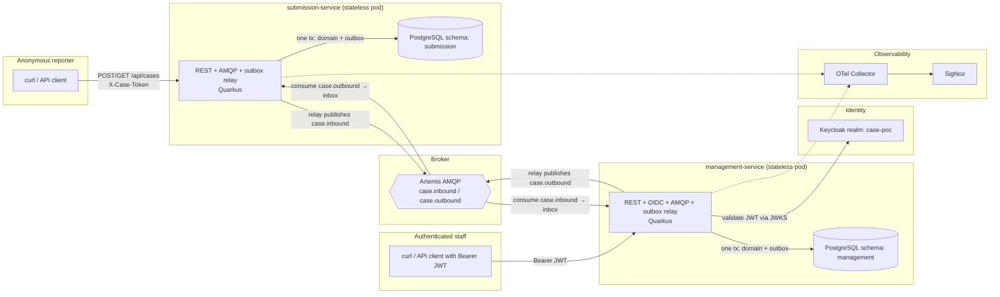

# Phase 2 — Kubernetes-Ready Application Design: Persistence, Identity, and Reliable Messaging

> **Scope of this document.** This is the second application-development stage of the thesis artefact. It assumes Phase 1 exists: two Quarkus services, ActiveMQ Artemis over AMQP, SigNoz/OpenTelemetry, a two-way text-only case thread, and no direct service-to-service calls. Phase 2 does not rebuild Phase 1. It restructures the application so that it *deserves* to run on Kubernetes: durable state, stateless pods, crash-safe messaging, externalized configuration, probe-ready health, and token-based/OIDC security — all proven in `docker-compose` first, then promoted unchanged to the k3s cluster from the infrastructure track.

---

## 1. Thesis Framing: Kubernetes Capabilities Demonstrated by Application Design

Kubernetes gives you rescheduling, rolling updates, horizontal scaling, and self-healing — but only applications designed for those mechanics actually benefit from them. Phase 1 deliberately violated this (in-memory state, single replica, commit-after-publish). Phase 2 fixes each violation with a named, citable pattern. This table is the thesis argument in miniature:

| # | Kubernetes capability | What Kubernetes assumes about the app | Phase 2 design answer |
|---|---|---|---|
| 1 | **Pod rescheduling / self-healing** | A pod can be killed at any instant and recreated elsewhere; nothing in the container filesystem or memory survives. | All state moves to PostgreSQL. Application pods become fully **stateless** — no PVC, no `emptyDir`, no session memory. |
| 2 | **Horizontal scaling (`replicas > 1`, HPA later)** | Any replica can serve any request; background work must not be duplicated by concurrent replicas. | No sticky sessions (token/JWT auth is stateless). The outbox relay claims rows with `SELECT … FOR UPDATE SKIP LOCKED`, so multiple replicas cooperate instead of double-publishing. |
| 3 | **Rolling updates / zero-downtime deploys** | Old and new pods overlap; in-flight messages may be redelivered to either. | **Transactional inbox**: consumers are idempotent across processes and restarts via a persistent `inbox_events` table, replacing the Phase 1 in-memory `seen` set. |
| 4 | **At-least-once delivery under eviction (OOMKill, node drain)** | A pod may commit a DB transaction and die before its next instruction. | **Transactional outbox**: domain change + event are committed in *one* local transaction; a relay publishes asynchronously and retries with bounded backoff. This replaces Phase 1 commit-after-publish. |
| 5 | **Liveness / readiness / startup probes** | The platform decides restart and traffic routing from HTTP health endpoints. | `quarkus-smallrye-health` already exposes `/q/health/live`, `/ready`, `/started`; Phase 2 makes readiness *meaningful* by including the datasource and AMQP channel checks. |
| 6 | **Graceful termination (SIGTERM → grace period)** | The app gets SIGTERM, then a grace window to drain in-flight work. | Quarkus graceful shutdown (`quarkus.shutdown.timeout`) drains HTTP and lets the current outbox batch finish; anything unpublished is simply picked up after restart — the outbox makes shutdown *safe by construction*. |
| 7 | **ConfigMaps and Secrets** | Configuration and credentials are injected from the environment, never baked into images. | Every environment-specific value (DB URL/credentials, AMQP, OIDC issuer, OTLP endpoint) is an env-overridable MicroProfile Config property. Compose `environment:` maps 1:1 to future ConfigMap/Secret keys. |
| 8 | **Jobs / init-time schema management** | Schema changes must be automated and safe when several pods start at once. | **Flyway** versioned migrations, `migrate-at-start` locally; Flyway's advisory locking keeps concurrent starts safe. On k3s the same migration can later run as an init container or Job without code change. |
| 9 | **Namespace/RBAC-style least privilege, mirrored in data** | Workload isolation is only as good as the data isolation behind it. | Database-per-service ownership: separate schemas *and* separate DB users; neither service can read the other's schema. Artemis stays the only integration point. |
| 10 | **Ingress-level identity (OIDC)** | AuthN/AuthZ must not rely on network position ("inside the cluster" is not an identity). | Keycloak-issued JWTs protect the management API. Validation is stateless (JWKS), so it works identically for 1 or N replicas. |
| 11 | **Observability in a distributed scheduler's world** | Requests hop across pods; logs alone can't reconstruct causality. | OpenTelemetry trace context is *persisted with each outbox row* and restored at relay time, so one trace spans HTTP → DB → outbox relay → AMQP → consumer → DB even though a scheduler runs the publish. |

**Promotion rule (compose-first):** every capability above must be demonstrable in `docker-compose` on a laptop before anything is deployed to k3s. The compose stack is the parity environment: same images, same env-var contract, same health endpoints. The later Helm values file must only *re-address* the same knobs, never introduce new behavior.

**The one thing to prove end-to-end:** the Phase 1 traced message flow still works after replacing in-memory state with PostgreSQL and protecting the management API with Keycloak — and now also survives service restarts, broker outages, and duplicate deliveries.

The reviewer should be able to:

1. Submit an anonymous case.
2. Restart (or `docker kill`) both application services and lose nothing.
3. Log in as an authenticated staff user, view and reply to the case, and see the staff identity recorded on the reply.
4. Stop Artemis, keep submitting/replying (HTTP still returns success — the local transaction committed), restart Artemis, and watch the pending outbox rows publish.
5. Replay an event and see the inbox reject the duplicate.
6. Open SigNoz and confirm one coherent trace: HTTP → domain + outbox insert → relay publish → AMQP → consume → inbox + message insert.

**Out of scope for Phase 2:** attachments/ClamAV/MinIO, Angular frontends, the Kubernetes manifests themselves (Helm/ingress/TLS/HPA — that is the infrastructure track), multi-tenancy, service mesh/mTLS, CI/CD, production rate limiting.

---

## 2. Phase 1 Baseline to Keep

Do not change these architectural rules:

- `submission-service` and `management-service` never call each other directly; Artemis is the only integration point.
- Reporter-to-staff messages use `case.inbound`; staff-to-reporter messages use `case.outbound` (same durable queues, FQQN bindings, DLQ, and bounded redelivery).
- `submission-service` stays anonymous on the reporter side: access token only, `404` on wrong/missing token so case existence is never revealed.
- OpenTelemetry propagates trace context across AMQP; text-only messages remain the payload.

What Phase 2 deliberately *changes* from Phase 1:

```text
Phase 1: in-memory store + in-memory dedupe + commit-after-publish (HTTP waits for broker settle)
Phase 2: PostgreSQL store + inbox table + transactional outbox (HTTP returns after local commit;
         a relay publishes asynchronously — eventual consistency, broker outages tolerated)
```

The commit-after-publish pattern and its `503`-on-broker-down behavior are retired: with an outbox, a broker outage is no longer a request failure, which is exactly the decoupling a self-healing platform expects.

---

## 3. System Overview



---

## 4. Components

| Component | Responsibility in Phase 2 |
|---|---|
| `submission-service` | Persists anonymous cases, token hashes, messages, outbox and inbox rows in schema `submission`. Publishes `case.inbound` through its outbox relay; consumes `case.outbound` idempotently. Stateless: safe to kill, restart, and (relay included) scale out. |
| `management-service` | Same persistence pattern in schema `management`. All endpoints require a Keycloak JWT with role `case-manager`; the reply author comes from the token (`preferred_username`). Publishes `case.outbound`, consumes `case.inbound`. |
| PostgreSQL | One local instance; strict per-service ownership: separate schema + separate DB user per service, no cross-schema grants. Mirrors database-per-service without the operational cost of two instances. |
| Keycloak | Realm `case-poc`, client `management-api`, realm role `case-manager`, at least one staff user (imported at startup from a checked-in realm export). Only `management-service` validates tokens. |
| Artemis | Unchanged from Phase 1: same addresses, durable queues, DLQ, bounded redelivery. |
| SigNoz / OTel Collector | Unchanged backend; now also shows JDBC spans and the outbox relay spans stitched into the request trace. |

---

## 5. Functional Requirements

### 5.1 Persistent reporter workflow

API unchanged:

- `POST /api/cases` with `{ "message": "<text>" }`
- `GET /api/cases/{caseId}` with `X-Case-Token`
- `POST /api/cases/{caseId}/messages` with `X-Case-Token` and `{ "message": "<text>" }`

Implementation changes:

- Cases and messages live in the `submission` schema; history survives restarts.
- Only the SHA-256 hash of the access token is stored; plaintext is returned exactly once at creation (Phase 1 `TokenService` already does the hashing — keep it).
- Wrong/missing token keeps returning `404`.
- `POST` endpoints now mean "committed locally, will be delivered": they return success once the *database transaction* (domain rows + outbox row) commits. They no longer wait for the broker.

### 5.2 Authenticated management workflow

All management endpoints require a valid Bearer JWT from Keycloak:

- `GET /api/cases?status=open`
- `GET /api/cases/{caseId}`
- `POST /api/cases/{caseId}/reply`

Authorization:

- Missing/invalid token → `401`; valid token without role `case-manager` → `403`.
- The reply author is taken from the authenticated principal (`preferred_username`, falling back to `sub`) — never from the request body.
- No management endpoint is reachable without OIDC in Phase 2.

### 5.3 Transactional outbox (publish side)

Every state-changing command writes the domain change *and* the event into `outbox_events` in the same transaction:

- create case → insert case + first message + `case.inbound` outbox row
- reporter follow-up → insert message + `case.inbound` outbox row
- staff reply → insert message + `case.outbound` outbox row

The relay (a Quarkus `@Scheduled` job in each service):

1. Claims pending rows with `SELECT … FOR UPDATE SKIP LOCKED ORDER BY created_at` (replica-safe by construction).
2. Publishes to Artemis and waits for broker settlement.
3. Marks the row `PUBLISHED` on ack.
4. On failure, increments `attempts`, records `last_error`, and backs off (bounded exponential via `next_attempt_at`).

Rationale: PostgreSQL and Artemis do not share a transaction. Without the outbox, a pod evicted between commit and publish silently loses the event — the exact failure mode Kubernetes' scheduler makes routine.

### 5.4 Persistent inbox (consume side)

Every AMQP consumer, per delivery:

1. Open a transaction.
2. `INSERT` the `eventId` into `inbox_events`; on conflict → already processed → ack and stop.
3. Apply the message to local `cases`/`messages`.
4. Commit, then ack.

At-least-once delivery + persistent idempotency = effectively-once processing, valid across restarts, redeliveries, and overlapping pods during a rolling update.

### 5.5 Event schema

Unchanged from Phase 1 (stable contract):

```jsonc
{
  "eventId": "0f2c...-uuid",
  "caseId": "a91b...-uuid",
  "direction": "inbound",
  "author": "reporter",
  "seq": 3,
  "body": "free-text message",
  "createdAt": "2026-01-15T10:04:12.501Z"
}
```

- `eventId` stays the idempotency key; `seq` stays authored per case and side.
- Staff-authored events set `author` to the Keycloak principal.
- Richer identity later means a *versioned* schema, not a silent change.

---

## 6. Data Ownership and Schema

One PostgreSQL instance locally; strict ownership:

```text
database: case_poc
  schema submission — user submission_service (no grants on management)
  schema management — user management_service (no grants on submission)
```

Identical table categories per schema, created by Flyway (`V1__...` per service; never Hibernate auto-DDL):

```text
cases(
  case_id uuid primary key,
  status text not null,
  access_token_hash text,           -- submission schema only
  created_at timestamptz not null,
  updated_at timestamptz not null
)

messages(
  message_id uuid primary key,
  event_id uuid not null unique,
  case_id uuid not null references cases(case_id),
  direction text not null,
  author text not null,
  seq integer not null,
  body text not null,
  created_at timestamptz not null
)

inbox_events(
  event_id uuid primary key,
  received_at timestamptz not null
)

outbox_events(
  event_id uuid primary key,
  case_id uuid not null,
  address text not null,
  payload jsonb not null,
  traceparent text,
  tracestate text,
  status text not null,             -- PENDING | PUBLISHED | FAILED
  attempts integer not null default 0,
  next_attempt_at timestamptz not null,
  created_at timestamptz not null,
  published_at timestamptz,
  last_error text
)
```

---

## 7. Trace Continuity Through the Outbox

The relay decouples the HTTP request from the AMQP publish, so trace context must be persisted, not assumed:

- **Command time:** capture the current W3C `traceparent`/`tracestate` and commit them with the outbox row.
- **Relay time:** restore the stored context, open an `outbox.publish` span under it, and send while that span is current. The SmallRye AMQP connector then injects the active context into the message as in Phase 1 — no manual AMQP trace properties.

Acceptance condition: the SigNoz trace for a submission reads as one flow that *visibly includes* the relay hop. The outbox is a reliability boundary; the trace should show it, not hide it.

---

## 8. Quarkus Extensions and Configuration

Keep from Phase 1: `quarkus-rest`, `quarkus-rest-jackson`, `quarkus-messaging-amqp`, `quarkus-opentelemetry`, `quarkus-smallrye-health`.

Add to **both** services:

- `quarkus-hibernate-orm-panache`
- `quarkus-jdbc-postgresql`
- `quarkus-flyway`
- `quarkus-scheduler` (outbox relay)

Add to **management-service** only:

- `quarkus-oidc`
- `quarkus-security`

Configuration stays 12-factor: defaults in `application.properties` for local dev, everything environment-overridable (the compose `environment:` block *is* the future ConfigMap/Secret). Example (`submission-service`):

```properties
quarkus.datasource.db-kind=postgresql
quarkus.datasource.jdbc.url=${DB_URL:jdbc:postgresql://localhost:5432/case_poc}
quarkus.datasource.username=${DB_USERNAME:submission_service}
quarkus.datasource.password=${DB_PASSWORD:submission_service}

quarkus.hibernate-orm.database.default-schema=submission
quarkus.hibernate-orm.database.generation=none
quarkus.flyway.migrate-at-start=true
quarkus.flyway.schemas=submission

# K8s-readiness: readiness fails when DB or broker are unreachable; graceful drain window.
quarkus.datasource.health.enabled=true
quarkus.shutdown.timeout=10
```

`management-service` adds:

```properties
quarkus.oidc.auth-server-url=${OIDC_AUTH_SERVER_URL:http://localhost:8180/realms/case-poc}
quarkus.oidc.client-id=management-api
quarkus.oidc.application-type=service
```

Role mapping: use a Keycloak **realm role** `case-manager` (lands in `realm_access.roles`, which Quarkus maps by default) and enforce it with `@RolesAllowed("case-manager")`.

---

## 9. Compose-First Local Environment

Extend the Phase 1 stack (`infra/docker-compose.yml`) with:

- `postgres` — with an init script creating the two schemas, two users, and grants.
- `keycloak` — with `--import-realm` and a checked-in `case-poc` realm export (client `management-api`, role `case-manager`, staff user).
- Health checks on both, so the app services start ordered (`depends_on: condition: service_healthy`) — compose's stand-in for probes + readiness gating.

| Service | Host port |
|---|---|
| PostgreSQL | `5432` |
| Keycloak | `8180` (host) → `8080` (container) |
| Artemis AMQP / console | `5672` / `8161` |
| submission-service / management-service | `8080` / `8081` |
| SigNoz UI | Phase 1 port (separate compose file, `signoz-net`) |

Secrets are plain local values in compose for the POC; they are env-injected (never baked into images or code), which is the property that matters for the Secret migration later.

---

## 10. Demo and Acceptance Criteria

Each criterion is phrased as the Kubernetes behavior it rehearses.

### 10.1 Statelessness (pod rescheduling)

Submit a case, verify rows in `submission.*` and (after relay/consume) `management.*`, then restart **both** services — `docker compose restart` or `docker kill` for realism. The full thread must still be served.

### 10.2 Identity (ingress-level auth)

`GET /api/cases` without token → `401`; garbage token → `401`; valid token without `case-manager` → `403`; staff token → `200`. A staff reply's `author` equals the JWT's `preferred_username`.

### 10.3 Outbox (eviction/broker-outage safety)

Stop Artemis. Submit a message — HTTP still succeeds and the outbox row stays `PENDING` with growing `attempts`. Restart Artemis — the row flips to `PUBLISHED` and the other service stores the event exactly once.

### 10.4 Inbox (rolling-update duplicate safety)

Redeliver the same event (replay from console or resend). The second delivery conflicts on `inbox_events.event_id`, is acked, and creates no duplicate message.

### 10.5 Probes and graceful shutdown

`/q/health/ready` on both services reports DB and AMQP checks; it goes DOWN while PostgreSQL is stopped. `docker stop` (SIGTERM) produces a clean drain within the shutdown timeout, and nothing is lost afterwards.

### 10.6 Observability

One SigNoz trace covers: HTTP span → JDBC spans (domain + outbox insert) → relay `outbox.publish` span → AMQP publish → AMQP consume in the other service → JDBC spans (inbox + message insert).

---

## 11. Build Order (one vertical slice at a time)

1. Compose: add PostgreSQL (schemas/users/grants init) and Keycloak (realm import) with health checks.
2. `submission-service`: extensions, Flyway `V1`, entities/repositories replacing the in-memory store.
3. `submission-service`: persistent inbox consumer; transactional outbox + relay with stored trace context.
4. `management-service`: same persistence, inbox, outbox.
5. `management-service`: OIDC + `@RolesAllowed`, author from JWT.
6. Compose wiring for both services (DB/OIDC env vars); meaningful readiness.
7. Verify §10 end to end, including SigNoz trace continuity.

Only after §10 passes in compose does the k3s deployment (Helm values, probes, ConfigMaps/Secrets) get updated — in the infrastructure track, not here.

---

## 12. Assumptions to Review

- Phase 1 is implemented and working; services stay independently deployable with Artemis as the only link.
- One local PostgreSQL instance is acceptable; ownership is enforced by schema + user, not by instance count.
- Management auth is required in Phase 2; reporter access stays anonymous and token-only.
- The outbox introduces **eventual consistency**: a successful HTTP response means "committed locally", not "consumed by the other side". This is an intended, demonstrable property, not a bug.
- The AMQP connector still injects trace context from the active span; the outbox only stores/restores that context around the publish.
- Attachments, object storage, frontends, autoscaling: later phases.
