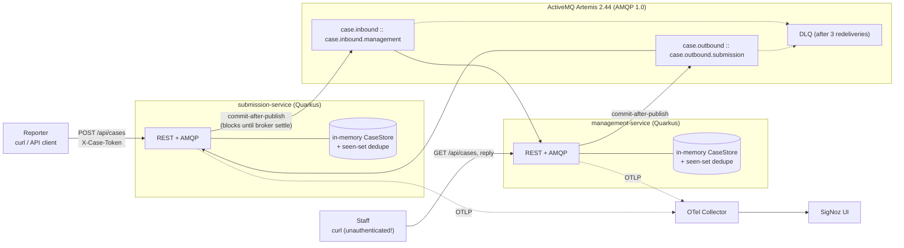
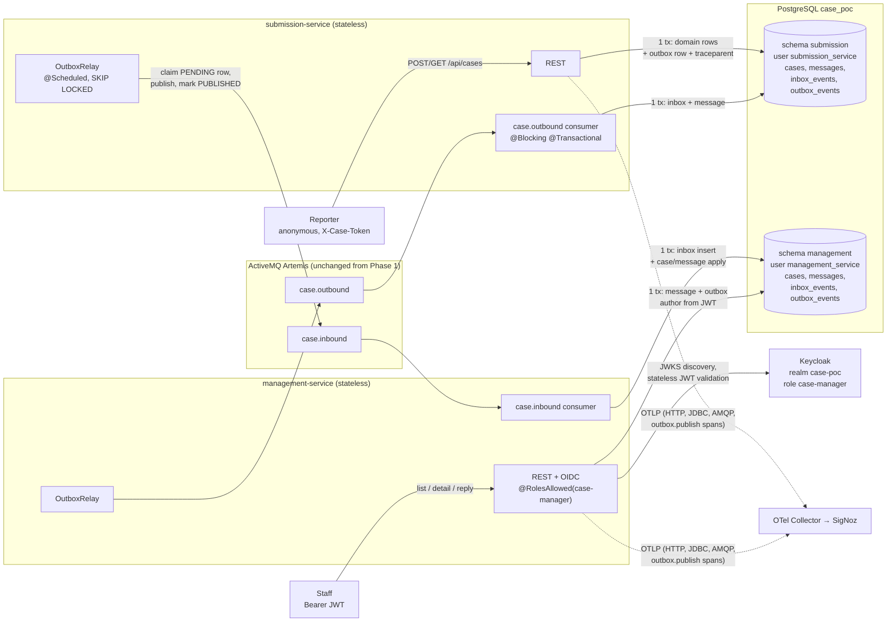
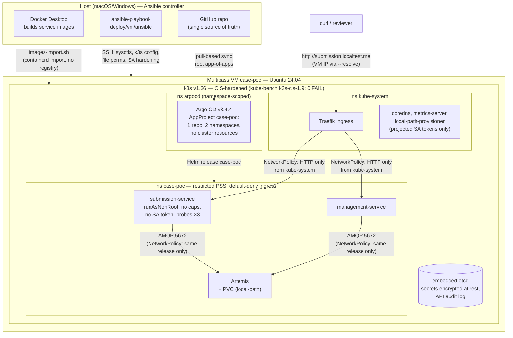

# Project Review — Architecture, Best Practices, and Research Principles

> Full-project review as of 2026-07-06 (branch `phase2`). Covers the three layers of the
> artefact: the Phase 1 application, the Phase 2 application, and the k3s cluster/GitOps
> track. Each section gives the architecture diagram, what the layer proves, an
> assessment of the practices used (with file evidence), and the gaps. §6 is the
> consolidated principles catalogue for further research.

---

## 1. What the artefact is

An anonymous case-management POC built to *demonstrate* cloud-native design rather than
to ship a product: two Quarkus services (`submission-service` for anonymous reporters,
`management-service` for staff) that integrate **only** through an ActiveMQ Artemis
broker, observed end-to-end with OpenTelemetry/SigNoz, developed compose-first, and
deployed onto a CIS-hardened single-node k3s cluster via Argo CD GitOps.

The three layers were built in deliberate order, each proving one thing:

| Layer | Proves | Status |
|---|---|---|
| Phase 1 app | One distributed trace per user action across an async AMQP hop | done, superseded by Phase 2 |
| Phase 2 app | The same flow with durable state, reliable messaging, and OIDC — i.e. an app that *deserves* Kubernetes | done, verified in compose (see `application-architecture/phase-2-implementation-state.md`) |
| Cluster track | A CIS-clean k3s cluster whose entire state is git-defined | done for the **Phase 1** app; Phase 2 promotion is open |

---

## 2. Phase 1 architecture (baseline, superseded)

**Key properties** (details: `docs/architecture.md`)

- No direct service-to-service calls; the broker is the single integration point.
  Producers are address-oriented; consumers bind durable queues via Artemis FQQN.
- Commit-after-publish: HTTP success only after the broker settles the message; local
  state staged before, committed after. Honest, but couples request latency and
  availability to the broker — replaced by the outbox in Phase 2.
- In-memory everything (explicitly by design): single replica, state lost on restart.
- Fail-loudly consumers + bounded redelivery (3×, 1s) + DLQ; poison-message demo marker.
- Anti-enumeration token model: 256-bit token shown once, SHA-256 hash stored,
  constant-time compare, wrong/missing token → 404 (never 403).
- One trace per user action; conversation stitched by `case.id`/`conversation.id`
  attributes and span links to the latest prior opposite-direction event.

**Verdict:** a disciplined baseline whose known deficiencies (no persistence, no
auth on management, publish-timeout edge case) were documented up front and each closed
by exactly one Phase 2 mechanism. This traceability from limitation → pattern is the
strongest methodological asset of the project — keep it explicit in the thesis.

---

## 3. Phase 2 architecture (current application)

**What changed and why** (details: `application-architecture/phase-2-plan.md` §1 —
the Kubernetes-capability table is the design rationale)

- **Transactional outbox** replaces commit-after-publish: domain change + event commit
  atomically; the relay publishes asynchronously with settle-wait, capped exponential
  backoff, and `FOR UPDATE SKIP LOCKED` claiming (replica-safe by construction). A
  broker outage is no longer a request failure — verified live (§10.3 in the state file).
- **Persistent inbox** turns at-least-once delivery into effectively-once processing
  across restarts and overlapping replicas; the unique `messages.event_id` is the second
  line of defence.
- **Trace context is persisted** (`traceparent` per outbox row and message) and restored
  at relay time, so the SigNoz trace shows the reliability boundary instead of a
  detached scheduler trace; span links survive restarts now.
- **Strict data ownership**: one PostgreSQL instance, two schemas, two DB users, no
  cross-grants (`infra/postgres/init/01-schemas-users.sql`); Flyway per service, no
  Hibernate DDL.
- **Keycloak OIDC** on every management endpoint (`401/403/200` ladder verified);
  reply author from `preferred_username`, never from the request body. Issuer pinned via
  `KC_HOSTNAME` so host-fetched tokens validate inside the compose network.
- The reporter-side security model is unchanged (hash-only tokens, 404 anti-enumeration).

**Verdict:** the implementation matches the plan; 30 tests green against Dev Services
PostgreSQL + Artemis, all compose acceptance criteria verified. Residual design notes
worth acknowledging in the thesis (all acceptable at POC scope):

- `seq` is computed as `max(seq)+1` per case/side inside the transaction — two
  *concurrent* writes to the same case could mint the same seq (the event stays unique
  via `event_id`; thread ordering uses `createdAt, eventId` anyway).
- Outbox retry backoff can reorder events of one case after a failure (at-least-once,
  unordered — consumers tolerate this by design; say so explicitly).
- The check-then-insert inbox leaves the cross-replica race to the PK constraint +
  redelivery (documented in `InboxRepository`).

---

## 4. Cluster architecture (k8s POC track)

> **Important review finding:** the cluster track currently deploys the **Phase 1**
> application (chart has Artemis + the two services only — no PostgreSQL, no Keycloak;
> images tagged `1.0.0`, Argo CD tracks branch `k8s-poc`). Promoting Phase 2 into the
> chart is the single biggest open work item (§5.3).

**Practices in place** (details: `docs/k8s-poc.md`)

| Area | Measure | Evidence |
|---|---|---|
| Node/API hardening | kube-bench `k3s-cis-1.9` **0 FAIL** with workload deployed; secrets-encryption, audit log, EventRateLimit, protect-kernel-defaults | `deploy/cluster/k3s/config.yaml`, `docs/reports/kube-bench-2026-07-06.txt` |
| Admission | cluster-wide **restricted** Pod Security Standard default | `deploy/cluster/k3s/admission-config.yaml` |
| Workload security | `runAsNonRoot` + numeric UID, `allowPrivilegeEscalation: false`, drop ALL caps, `RuntimeDefault` seccomp, `automountServiceAccountToken: false` on every pod | `deploy/helm/.../_helpers.tpl`, deployments |
| Identity least-privilege | namespace-scoped Argo CD, non-wildcard Roles enumerating exactly the chart's kinds; projected expiring tokens for the few pods that need the API | `deploy/argocd/install/case-poc/argocd-rbac.yaml`, `scripts/harden-kube-system.sh` |
| Network | default-deny ingress; HTTP only from kube-system (Traefik); AMQP only from the release's pods | `templates/networkpolicies.yaml` |
| GitOps | app-of-apps root, AppProject guardrails (one repo, two namespaces, `clusterResourceWhitelist: []`), two-phase bootstrap, pull-based sync | `deploy/argocd/` |
| Reproducibility | VM + k3s provisioned by an idempotent Ansible playbook from the host; every component version pinned | `deploy/vm/ansible/k3s-playbook.yml`, `docs/k8s-poc.md` |
| App operability | startup/readiness/liveness probes (readiness includes the broker link), resource requests/limits, PVC for the broker journal | `templates/*-deployment.yaml` |

**Verdict:** for a single-node POC this is an unusually complete security/GitOps
baseline — the kube-bench-with-workload pass and the "make bundled workloads genuinely
compliant instead of relying on the profile whitelist" decision are thesis-grade
material. The gap is currency, not quality: the cluster runs yesterday's app.

---

## 5. Consolidated gaps and recommendations (ranked)

1. **Promote Phase 2 to the cluster.** The Helm chart needs PostgreSQL (StatefulSet or
   operator + init job for schemas/users), Keycloak (+ realm import, issuer strategy —
   the compose `KC_HOSTNAME=localhost:8180` pin must become the ingress host), and the
   services' `DB_URL`/`DB_USERNAME`/`DB_PASSWORD`/`QUARKUS_OIDC_*` env contract mapped to
   ConfigMaps/Secrets. The compose file was deliberately written as this contract.
2. **Show the payoff: run `replicas: 2`.** The whole Phase 2 design (stateless pods,
   SKIP LOCKED relay, inbox) exists to make this safe; demonstrating it on k3s (plus a
   rolling update under load) would close the argument. Currently everything is
   single-replica.
3. **Secrets hygiene.** POC credentials sit in `values.yaml`/compose/realm JSON. Fine
   locally and documented as such, but the thesis should name the production path
   (External Secrets Operator / SOPS / sealed-secrets) — and the repo is public-ready
   only because the values are throwaway.
4. **Observability in the cluster** is disabled (`otel.enabled=false`, no collector).
   Deploying a collector (or SigNoz) into the VM would let §10.6 run on k3s too.
5. **Supply chain**: images are hand-imported into containerd; no registry, no CI, no
   image signing/SBOM. Listed as future work — keep it named, it is the biggest
   real-world delta.
6. **Availability of stateful pieces**: single Artemis with a PVC, single PostgreSQL,
   embedded etcd on one node; no backups. Acceptable for the POC, worth one paragraph of
   "what HA would require" (broker HA pairs / operator, PG replication, etcd snapshots).
7. **TLS nowhere** (ingress plain HTTP, Argo CD via port-forward). cert-manager +
   Traefik TLS would be a small, high-visibility addition.
8. **Argo CD drift**: `targetRevision: k8s-poc` predates the `phase2` branch — align
   branches (or merge and track `HEAD`) when doing item 1, and re-run kube-bench after
   the workload changes (the 5.1.6 note in `docs/k8s-poc.md` explains why any new pod
   can flip that check).

---

## 6. Principles catalogue (for further research)

Grouped by layer; each row names the principle as used in this artefact and where to dig
deeper. These are the citable anchors for the thesis' related-work and methodology
chapters.

### 6.1 Application & integration design

| # | Principle / pattern | Used here as | Research anchor |
|---|---|---|---|
| 1 | Twelve-Factor App (config, backing services, disposability, dev/prod parity) | env-overridable MicroProfile config = future ConfigMap/Secret; compose-first parity rule | 12factor.net; Wiggins |
| 2 | Database-per-service / strict data ownership | schema + dedicated DB user per service, no cross-grants | microservices.io (Richardson); Newman, *Building Microservices* |
| 3 | Messaging as the only integration point ("smart endpoints, dumb pipes") | no service-to-service HTTP; Artemis AMQP 1.0 with FQQN durable queues | Fowler, *Microservices*; Hohpe/Woolf, *Enterprise Integration Patterns* |
| 4 | Transactional Outbox | `outbox_events` + `@Scheduled` relay, settle-wait, PENDING→PUBLISHED | microservices.io/patterns/data/transactional-outbox; Kleppmann, *DDIA* ch. 9 |
| 5 | Idempotent Consumer / Inbox | `inbox_events` PK insert in the apply transaction; unique `event_id` backstop | microservices.io/patterns/communication-style/idempotent-consumer |
| 6 | At-least-once delivery + effectively-once processing | broker redelivery + inbox dedupe; duplicates acked without effect | Kleppmann, *DDIA*; Artemis redelivery docs |
| 7 | Eventual consistency with explicit semantics | POST = "committed locally, will be delivered"; documented in API contract | Vogels, *Eventually Consistent*; Bailis et al. |
| 8 | Competing consumers, safe with replicas | `SELECT … FOR UPDATE SKIP LOCKED` row claiming | PostgreSQL docs (row locking); EIP *Competing Consumers* |
| 9 | Bounded retry with exponential backoff + DLQ | relay backoff cap 30s; broker 3× redelivery → DLQ; poison-marker demo | AWS Architecture Blog (backoff+jitter); EIP *Dead Letter Channel* |
| 10 | Stable event contract, versioned evolution | Phase 1 JSON schema kept verbatim; "add a versioned schema, never mutate" rule | Fowler, *Schema evolution*; CloudEvents spec as contrast |
| 11 | Schema migration as code | Flyway `V1__…` per service, `migrate-at-start`, no auto-DDL | Flyway docs; *Refactoring Databases* (Ambler/Sadalage) |
| 12 | Anti-enumeration + hash-only credentials | 404-never-403, token shown once, SHA-256 + constant-time compare | OWASP ASVS (V3/V6); OWASP *Testing for Account Enumeration* |
| 13 | Stateless token-based AuthN/AuthZ (OIDC/JWT, roles) | Keycloak realm role `case-manager`, JWKS validation, author from `preferred_username` | OpenID Connect Core spec; RFC 7519/9068; Keycloak docs |

### 6.2 Observability

| # | Principle / pattern | Used here as | Research anchor |
|---|---|---|---|
| 14 | Distributed tracing with W3C Trace Context | `traceparent` propagation HTTP→AMQP; one trace per user action | w3.org/TR/trace-context; OpenTelemetry spec |
| 15 | Trace-context persistence across async boundaries | traceparent stored per outbox row, restored under `outbox.publish` span | OTel messaging semantic conventions; *worth-noting.md* links |
| 16 | Domain + semantic-convention attributes side by side | `case.id`/`conversation.id` next to `messaging.*` attributes | OTel semantic conventions (messaging) |
| 17 | Span links for causally-related-but-separate traces | authored event links to latest prior opposite-direction event | OTel spec (links); Sigelman et al., *Dapper* |
| 18 | Making reliability boundaries visible, not hidden | the relay hop is a deliberate span, not smoothed over | Majors et al., *Observability Engineering* |

### 6.3 Kubernetes & platform engineering

| # | Principle / pattern | Used here as | Research anchor |
|---|---|---|---|
| 19 | Stateless workloads / pods-as-cattle | all app state in PostgreSQL; no PVC/emptyDir for services | Kubernetes docs; *Cloud Native Patterns* (Cornelia Davis) |
| 20 | Health probes as an API contract | startup/readiness/liveness on `/q/health/*`; readiness includes broker+DB | Kubernetes docs (probes); Quarkus SmallRye Health |
| 21 | Graceful termination | `quarkus.shutdown.timeout` as the terminationGracePeriod rehearsal | Kubernetes pod lifecycle docs |
| 22 | Externalized config → ConfigMap/Secret contract | compose `environment:` block mirrors future manifests 1:1 | Kubernetes docs; 12-factor III |
| 23 | Resource requests/limits | CPU requests + memory limits on every container | Kubernetes docs (QoS classes) |
| 24 | Restricted Pod Security Standard by default | cluster-wide PSS "restricted" via AdmissionConfiguration | Kubernetes PSS docs |
| 25 | Least-privilege identity (RBAC, no token automount) | non-wildcard namespace Roles; projected expiring SA tokens only where needed | Kubernetes RBAC docs; NSA/CISA Kubernetes Hardening Guide |
| 26 | Default-deny network segmentation | deny-all ingress + two explicit allows | Kubernetes NetworkPolicy docs |
| 27 | CIS benchmark as falsifiable baseline | kube-bench `k3s-cis-1.9`, 0 FAIL *with workload deployed*, report versioned | CIS Kubernetes/k3s Benchmark; aquasecurity/kube-bench |
| 28 | Secrets encryption at rest + API auditing | k3s `secrets-encryption: true`, audit policy/log flags | Kubernetes docs (encryption at rest, auditing) |
| 29 | GitOps (declarative, versioned, pulled, continuously reconciled) | Argo CD app-of-apps; AppProject guardrails; push-to-git = deploy | opengitops.dev principles; Argo CD docs |
| 30 | Infrastructure as Code, idempotent provisioning | Ansible playbook provisions VM+k3s over SSH, re-runnable | Ansible docs; Morris, *Infrastructure as Code* |
| 31 | Version pinning / reproducible environments | every component pinned (k3s, Argo CD, Artemis, SigNoz, Quarkus) | *Continuous Delivery* (Humble/Farley) |
| 32 | Compose-first promotion ("works on the laptop before the cluster") | plan §1 promotion rule; same images and env contract in both | 12-factor X (dev/prod parity) |

---

## 7. Review method note

This review was produced by reading the plans (`application-architecture/`), the
implementation of both services, the compose/infra definitions, the Helm chart, the
Argo CD manifests, the k3s hardening config, and the runbooks (`docs/`), and by
cross-checking claims against the verified e2e results in
`application-architecture/phase-2-implementation-state.md` and
`docs/reports/kube-bench-2026-07-06.txt`. Diagrams reflect the code as committed on
branch `phase2` (`db1c91c`), not aspirational state; the one aspirational element —
Phase 2 on the cluster — is marked as such in §4/§5.
