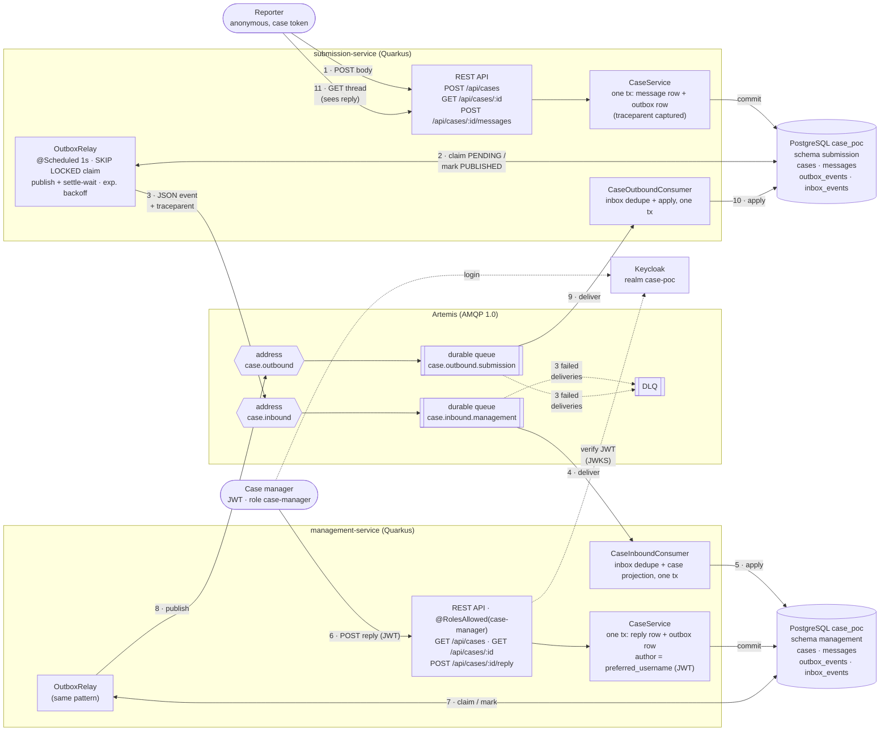
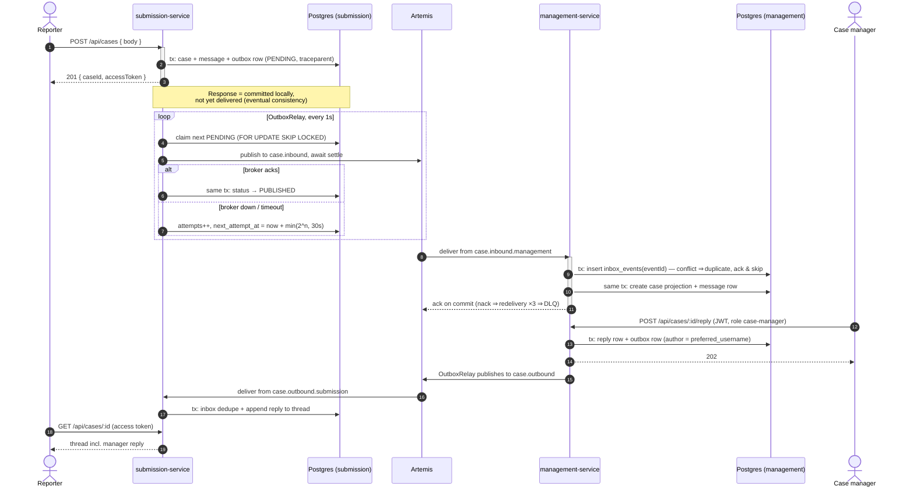

# End-to-End Messaging — Architecture

How a message travels between an anonymous reporter and a case manager. The two
services never call each other: every message crosses exactly one asynchronous
Artemis hop, made reliable by a **transactional outbox** on the sending side and a
**persistent inbox** on the receiving side (Phase 2 plan §5.3/§5.4).

## 1. Component view

Deliveries (4, 9) are at-least-once; the receiving inbox makes them effectively-once.
A nacked delivery is redelivered up to 3 times (1s delay) before Artemis dead-letters
it to `DLQ`. Both services connect to the same PostgreSQL instance but own disjoint
schemas — there are no cross-schema grants; the broker is the only integration path.

## 2. One message end to end (reporter → manager → reporter)

## 3. Why it is built this way

| Concern | Mechanism |
| --- | --- |
| No lost messages on broker outage | Outbox row commits with the domain change; POST never waits for the broker. Relay retries with capped exponential backoff (max 30s) until Artemis accepts. |
| No lost messages on service crash | Crash after broker-accept but before status update leaves the row `PENDING` → republished on restart (at-least-once). |
| No duplicate effects | Receiver inserts `event_id` into `inbox_events` in the same tx as the apply; a conflict means duplicate → ack without effect (effectively-once). |
| Poison messages can't block the queue | Consumer throws → nack (`failure-strategy=reject`) → Artemis bounded redelivery (3 × 1s) → `DLQ`. |
| Horizontal scaling | Relay rows claimed with `FOR UPDATE SKIP LOCKED`; consumers bind to shared durable queues (FQQN) — multiple pods compete safely. |
| Anonymity boundary | Reporter side is token-gated (SHA-256 hash, 404-on-bad-token); only the management side authenticates users via Keycloak OIDC. Identity never crosses the broker except as the chosen `author` label. |
| Trace continuity | `traceparent` is persisted on the outbox row; the relay's `outbox.publish` span restores it, so SigNoz shows HTTP → outbox → AMQP → consumer → DB as one trace. |

Event payload (unchanged since Phase 1): `eventId` (idempotency key), `caseId`,
`direction` (`inbound`/`outbound`), `author`, `seq`, `body`, `createdAt`.
